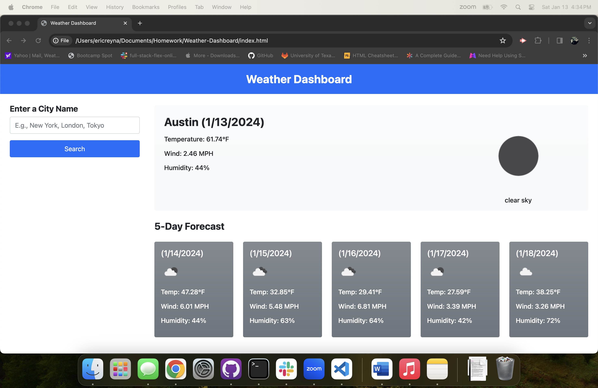

# Weather-Dashboard-Challenge-6
I was challenged to make a weather app

GIVEN a weather dashboard with form inputs
WHEN I search for a city
THEN I am presented with current and future conditions for that city and that city is added to the search history
WHEN I view current weather conditions for that city
THEN I am presented with the city name, the date, an icon representation of weather conditions, the temperature, the humidity, and the wind speed
WHEN I view future weather conditions for that city
THEN I am presented with a 5-day forecast that displays the date, an icon representation of weather conditions, the temperature, the wind speed, and the humidity
WHEN I click on a city in the search history
THEN I am again presented with current and future conditions for that city

I Made my Document using HTML format CSS styling and Javascript 

I used these websites to refrence codes and help me build my portfolio. https://coding-boot-camp.github.io/full-stack/html/html-cheatsheet https://www.w3schools.com/default.asp https://developer.mozilla.org/en-US/docs/Web/JavaScript https://stackoverflow.com/ https://day.js.org/en/ https://getbootstrap.com/docs/5.1/getting-started/introduction/

  
I have also addded a screenshot 

Deployed Application link [] https://ereyna21.github.io/Weather-Dashboard/

Repository link https://github.com/Ereyna21/Weather-Dashboard
